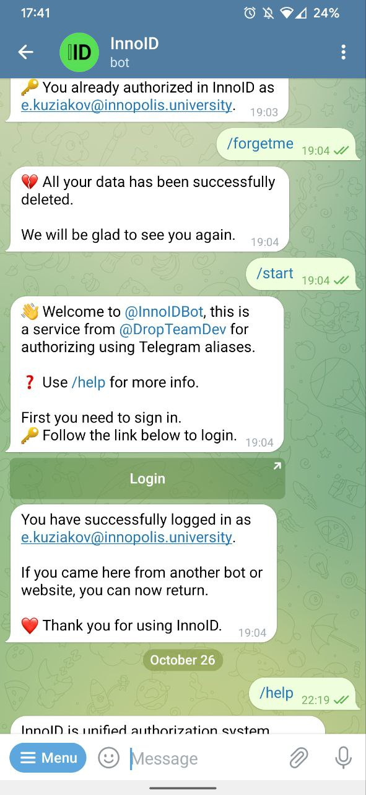
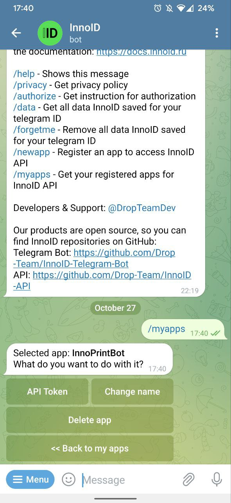
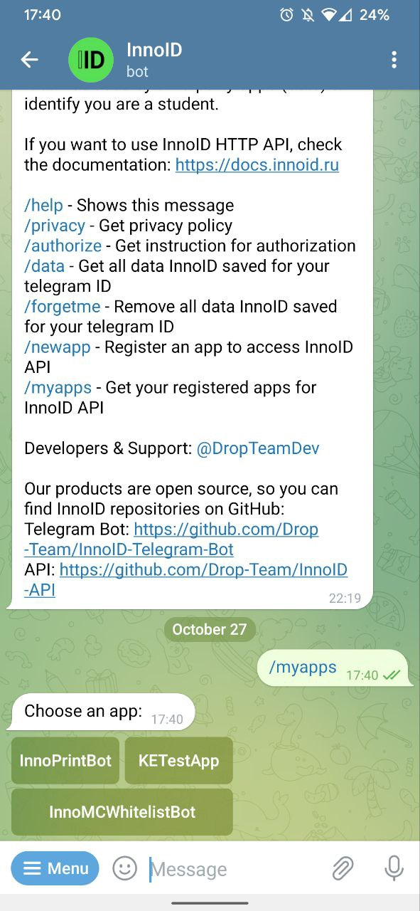

# InnoID

Unified authorization system for students and staff of Innopolis University.

## Table of Contents

- [About](#about)
- [Launching](#launching)


## About

InnoID is a system consisting of a REST API and a Telegram bot that uses it .

<p float="left">
  
  
  
</p>

### API
Has 2 models:
- User:
  - Has `Telegram ID`, `Is registered`, `Email` and other fields  that applications can request
- App:
  - Has different permissions in the API (By default: only getting the user)
  - Has different access to user fields (By default: only `Is authorized`)

### Bot

Associated with an App which has all permissions.
To register users, Microsoft Azure AD (for organizations) is used, 
which allows you to verify yourself using a university account.

After successful authorization, the data is transferred to the Longpoll server, 
from where the bot takes this data and confirms the user in the InnoID API.


## Launching

### Environment

First you need to set up the environment:
1. Rename `.env-example` to `.env`
2. Edit `.env`: Fill in the variables with empty values and edit the remaining ones if necessary

### Docker

Next you need to use Docker:

```console
docker-compose build
docker-compose up -d
```